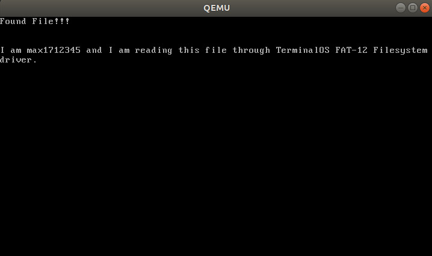
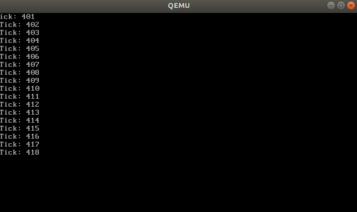

# TerminalOS (V3 probably?)

- So again, a new version of Terminal OS, hopefully the last one where i can finally make this run on hardware

# Installation

### Packages needed
- gcc compiler and binutils (i686-elf-gcc and i686-elf-ld)
- nasm
- qemu
- grub2
- some linux distro

### Steps
-   Make a mnt directory to mount the disk image for qemu to use
    ```
        mkdir mnt
    ```
-   Use make to do the following:
    ```
        make makeGrubDisk
    ```
    and then
    ```
        make run
    ```
    clean with
    ```
        make clean          # doesnt remove the disk.img created by makeGrubDisk, use cleanAll to erase all
    ```

# Known issues:
-   Build process has to be run twice for kernel changes to take effect, no idea why                        (FIXED)
-   FAT Filesystem code can access only the first block of data from disk for now, fix to be issued later.

# Planned Features:
- 32 bit protected mode operation
- FAT-12 readonly filesystem
- GRUB as bootloader
- TTY Text mode based interface
- POSIX compiliance         (maybe?)
- Kernel, User seperation   (maybe?)
- Paging
- Higher half kernel


# Finished Features
- 32 bit protected mode operation
- FAT-12 readonly filesystem    (Partially functional)
- GRUB as bootloader
- TTY Text mode based interface



